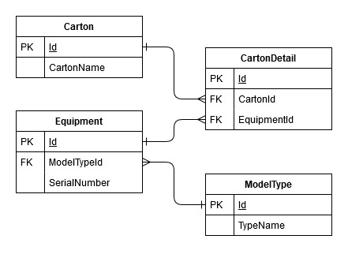

# Carton Builder

## Getting Started

1. To get started, clone this repo by running the following command: `git clone https://github.com/mblauta/carton-builder.git`
1. Navigate to where the files are copied locally.
1. Locate the solution file `CartonBuilder.sln` and double-click. *This will load the solution in Visual Studio.*
1. Once loaded, hit `F5` to run the application.

Once the solution compiled successfully, you should see the Carton Builder web application shortly.

## Warehouse Database ERD



## Troubleshooting

### File Not Found Exception Encountered

Running the application for the first time yields the following exception:

```Exception Details: System.IO.FileNotFoundException: Could not find file 'C:\carton-builder\application\CartonBuilder.Web\bin\roslyn\csc.exe'.```

**FIX:** Open the Package Manager Console in Visual Studio and execute the following command:

```Update-Package Microsoft.CodeDom.Providers.DotNetCompilerPlatform -r```

This will install or upgrade the .NET compiler.
